# 401 Pre Work

## SQL

My understanding of SQL is that it is a language for users to work with relational databases and is the most commonly used one. There are many different databases that work with SQL. The database is basically a table like an Excel sheet, with columns and as many rows as I add to it. There are a lot of different SQL commands I can use, including querying the data with SELECT commands and querying specific data with the WHERE command and sort the data with ORDER BY.

### 1-6 Exercises

- 
- 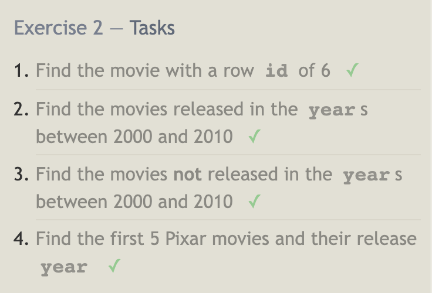
- 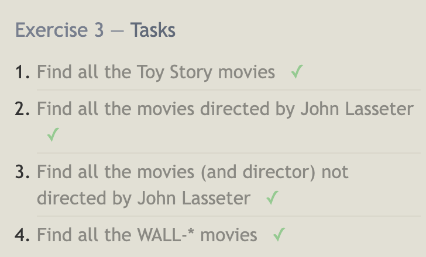
- 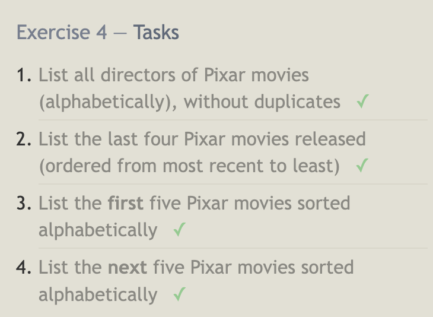
- 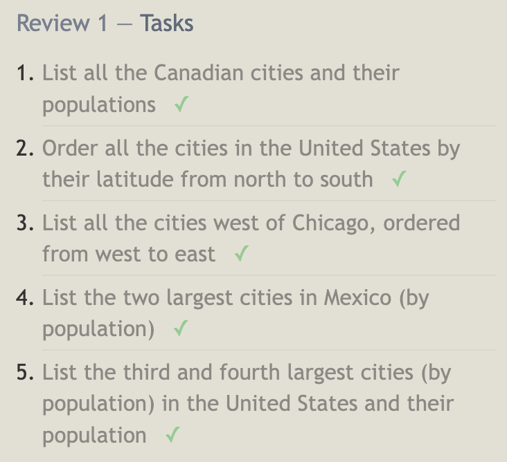
- 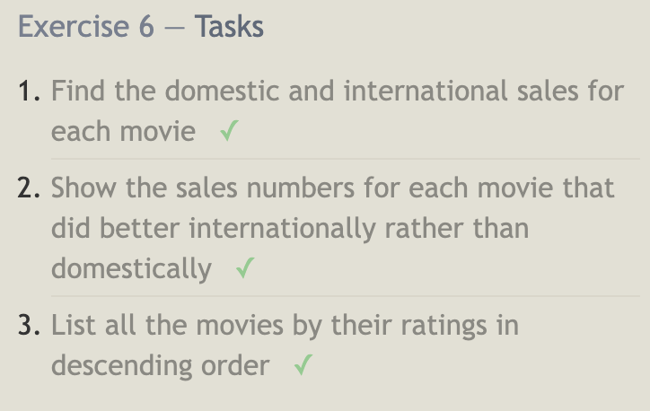

### 13-18 Exercises

- 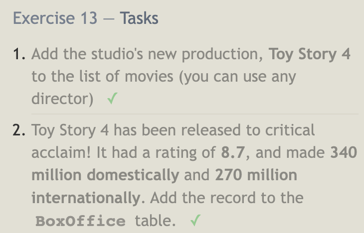
- 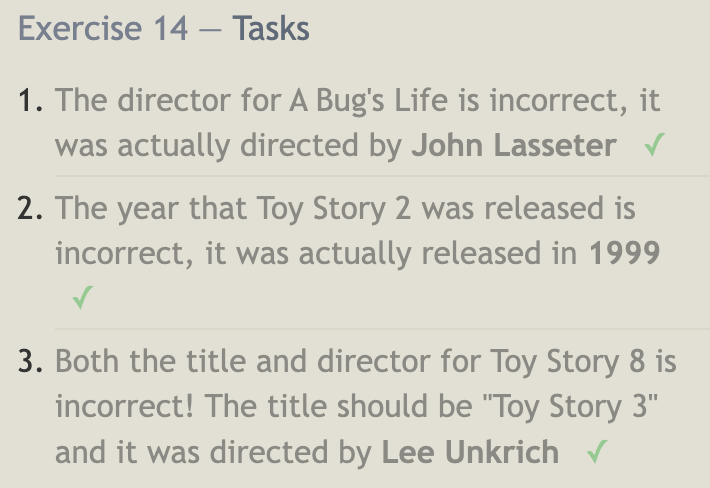
- 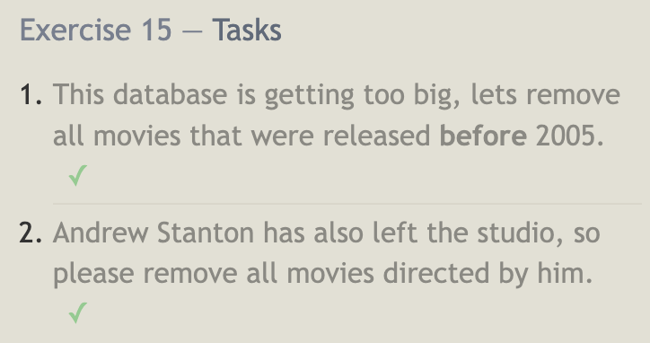
- 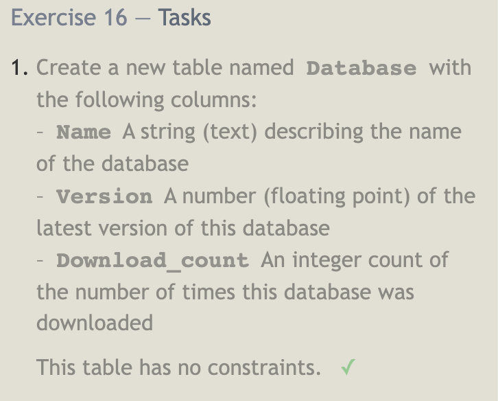
- 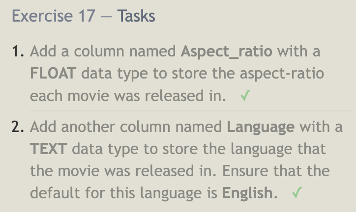
- 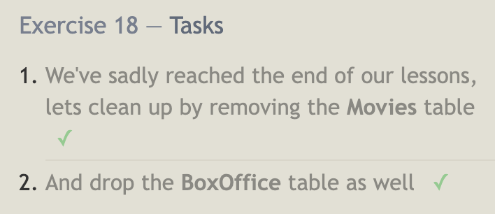
